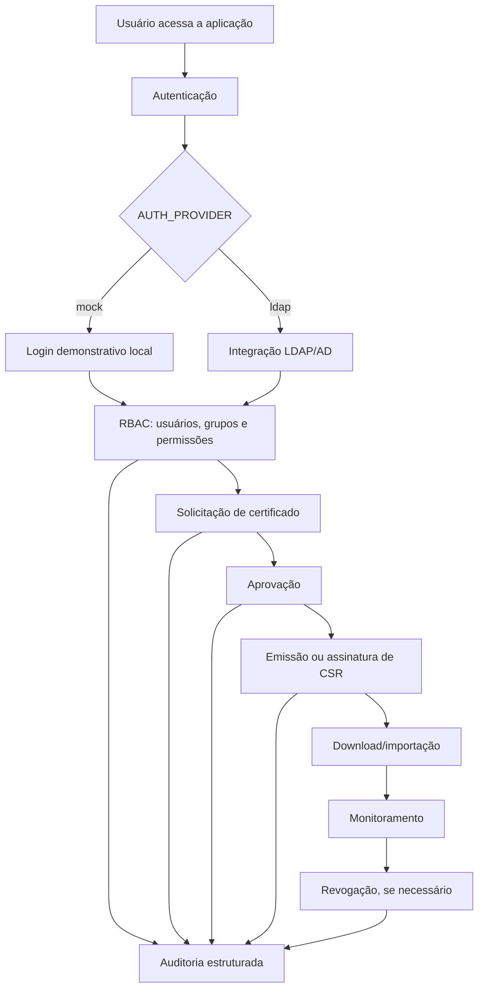

# 🛡️ Certificadora Web


Aplicação Flask para gestão do ciclo de vida de certificados digitais internos.

> **Status de portfólio:** este snapshot foi preparado para publicação como projeto demonstrativo. Ele preserva a arquitetura e os fluxos técnicos, mas substitui dependências corporativas por configuração mock e placeholders seguros.

O projeto foi sanitizado para portfólio público: **não inclui chaves privadas, certificados reais, logs, URLs internas, dados pessoais ou credenciais**.

---

## 📚 Sumário

- [🛡️ Certificadora Web](#️-certificadora-web)
  - [📚 Sumário](#-sumário)
  - [📌 Sobre o projeto](#-sobre-o-projeto)
  - [🎯 Objetivo do projeto](#-objetivo-do-projeto)
  - [✨ Destaques do projeto](#-destaques-do-projeto)
  - [🧰 Tecnologias utilizadas](#-tecnologias-utilizadas)
  - [✅ Pré-requisitos](#-pré-requisitos)
  - [🚀 Execução local em modo portfólio](#-execução-local-em-modo-portfólio)
    - [1. Clone ou acesse o projeto](#1-clone-ou-acesse-o-projeto)
    - [2. Crie e ative um ambiente virtual Python](#2-crie-e-ative-um-ambiente-virtual-python)
    - [3. Instale as dependências](#3-instale-as-dependências)
    - [4. Copie o arquivo de exemplo de variáveis de ambiente](#4-copie-o-arquivo-de-exemplo-de-variáveis-de-ambiente)
    - [5. Configure o arquivo `.env`](#5-configure-o-arquivo-env)
    - [6. Execute a aplicação](#6-execute-a-aplicação)
    - [7. Acesse a aplicação](#7-acesse-a-aplicação)
  - [⚙️ Configuração](#️-configuração)
  - [🔐 Atenção especial à `SECRET_KEY`](#-atenção-especial-à-secret_key)
  - [🧪 Testes e validação](#-testes-e-validação)
  - [💡 Exemplos de uso](#-exemplos-de-uso)
  - [🗂️ Estrutura de pastas](#️-estrutura-de-pastas)
  - [📌 Fluxo simplificado da aplicação](#-fluxo-simplificado-da-aplicação)
  - [🧾 Comandos úteis](#-comandos-úteis)
  - [🧯 Possíveis erros e soluções](#-possíveis-erros-e-soluções)
  - [🛡️ Cuidados e boas práticas de segurança](#️-cuidados-e-boas-práticas-de-segurança)
  - [🤝 Como contribuir](#-como-contribuir)

---

## 📌 Sobre o projeto

A **Certificadora Web** é uma aplicação web desenvolvida em **Flask** para demonstrar a gestão do ciclo de vida de certificados digitais internos.

Ela contempla fluxos como:

- autenticação;
- autorização baseada em papéis e permissões;
- solicitação de certificados;
- aprovação;
- emissão;
- download;
- importação;
- monitoramento;
- revogação;
- auditoria de eventos sensíveis.

Este projeto foi preparado para uso em **modo portfólio**, permitindo execução local sem dependência de infraestrutura corporativa real, como LDAP/AD, bancos de dados corporativos ou Autoridade Certificadora real.

---

## 🎯 Objetivo do projeto

O objetivo deste projeto é demonstrar uma arquitetura segura para uma aplicação de gestão de certificados digitais internos, com foco em:

- boas práticas de desenvolvimento seguro;
- separação de responsabilidades;
- autenticação e autorização;
- proteção de artefatos criptográficos;
- rastreabilidade por auditoria;
- execução local simplificada para demonstração;
- sanitização adequada para publicação pública.

---

## ✨ Destaques do projeto

- Autenticação via LDAP/AD ou provedor mock para demonstração local.
- MFA TOTP configurável.
- RBAC por usuários, grupos e permissões.
- Solicitação, aprovação, emissão, download, importação, monitoramento e revogação de certificados.
- Assinatura de CSR externa sem receber nem armazenar a chave privada do solicitante.
- Auditoria estruturada para eventos de autenticação, autorização e operações sensíveis.
- Controles de CSRF, validação de upload e separação de artefatos criptográficos.

---

## 🧰 Tecnologias utilizadas

Com base na estrutura e nos comandos do projeto, a aplicação utiliza:

| Tecnologia | Uso no projeto |
|---|---|
| Python | Linguagem principal da aplicação |
| Flask | Framework web |
| Jinja2 | Renderização de templates HTML |
| SQLite | Banco local em modo demonstração/portfólio |
| LDAP/AD | Integração opcional para autenticação real |
| MFA TOTP | Autenticação multifator configurável |
| RBAC | Controle de acesso por usuários, grupos e permissões |
| CSRF Protection | Proteção contra requisições forjadas |
| unittest | Execução de testes automatizados |

> Caso o arquivo `requirements.txt` liste bibliotecas adicionais, ele deve ser considerado a fonte oficial das dependências Python do projeto.

---

## ✅ Pré-requisitos

Antes de executar o projeto, garanta que você tenha instalado:

- **Python 3.x**;
- **pip**;
- **Git**, caso deseje clonar o repositório;
- terminal compatível com seu sistema operacional:
  - PowerShell no Windows;
  - Bash/Zsh no Linux ou macOS.

Também é recomendado conhecer o básico de:

- ambientes virtuais Python;
- variáveis de ambiente;
- execução de aplicações Flask;
- conceitos de certificados digitais, CSR, CA e chaves privadas.

---

## 🚀 Execução local em modo portfólio

Esta seção mantém o conteúdo original de execução local e o complementa com um passo a passo mais detalhado para reduzir erros durante a instalação.

### 1. Clone ou acesse o projeto

Se o projeto estiver em um repositório Git, clone-o:

```bash
git clone <URL_DO_REPOSITORIO>
cd <NOME_DO_REPOSITORIO>
```

Se você já possui os arquivos localmente, apenas acesse a pasta raiz do projeto:

```bash
cd caminho/para/certificadora-web
```

---

### 2. Crie e ative um ambiente virtual Python

#### Windows PowerShell

```powershell
python -m venv .venv
.\.venv\Scripts\Activate.ps1
```

#### Linux/macOS

```bash
python3 -m venv .venv
source .venv/bin/activate
```

> Conteúdo original preservado: **Crie e ative um ambiente virtual Python.**

---

### 3. Instale as dependências

Com o ambiente virtual ativo, execute:

```bash
pip install -r requirements.txt
```

> Conteúdo original preservado: **Instale as dependências: `pip install -r requirements.txt`**

Se necessário, atualize o `pip` antes da instalação:

```bash
python -m pip install --upgrade pip
```

---

### 4. Copie o arquivo de exemplo de variáveis de ambiente

#### Windows PowerShell

```powershell
Copy-Item .env.example .env
```

#### Linux/macOS

```bash
cp .env.example .env
```

> Conteúdo original preservado: **Copie o arquivo de exemplo: `Copy-Item .env.example .env`**

---

### 5. Configure o arquivo `.env`

Abra o arquivo `.env` e ajuste, no mínimo:

```env
SECRET_KEY=<gere_um_valor_seguro>
MOCK_AUTH_PASSWORD=<defina_uma_senha_para_demo>
DEMO_MODE=true
AUTH_PROVIDER=mock
```

> Conteúdo original preservado: **Ajuste `SECRET_KEY` e `MOCK_AUTH_PASSWORD` no `.env` local.**

Para ambiente local de portfólio, use `AUTH_PROVIDER=mock`. Para integração real, use `AUTH_PROVIDER=ldap` e configure as variáveis `LDAP_*`.

---

### 6. Execute a aplicação

#### Windows PowerShell

```powershell
python .\run.py
```

#### Linux/macOS

```bash
python run.py
```

> Conteúdo original preservado: **Execute: `python .\run.py`**

---

### 7. Acesse a aplicação

Abra o navegador em:

```text
http://127.0.0.1:5000/login
```

No modo demo, use qualquer usuário fictício, por exemplo:

```text
Usuário: demo.user
Senha: valor definido em MOCK_AUTH_PASSWORD
```

O projeto cria um banco SQLite local chamado:

```text
portfolio_demo.db
```

e concede permissões fictícias ao usuário autenticado.

> Conteúdo original preservado: **Acesse `http://127.0.0.1:5000/login`. No modo demo, use qualquer usuário fictício, por exemplo `demo.user`, com a senha definida em `MOCK_AUTH_PASSWORD`. O projeto cria um banco SQLite local (`portfolio_demo.db`) e concede permissões fictícias ao usuário autenticado.**

---

## ⚙️ Configuração

Variáveis importantes:

| Variável | Descrição | Observação |
|---|---|---|
| `DEMO_MODE` | Cria tabelas locais e evita dependência de infraestrutura real. | Recomendado para execução local de portfólio. |
| `AUTH_PROVIDER` | Use `mock` para portfólio local ou `ldap` para integração real. | Em demo, utilize `mock`. |
| `MFA_REQUIRED` | Controla a exigência de MFA TOTP. | Mantenha `true` fora de demonstrações locais. |
| `APP_DATABASE_URL` | URL/conexão do banco principal da aplicação. | Permite usar SQLite em demo. |
| `AUDIT_DATABASE_URL` | URL/conexão do banco de auditoria. | Permite usar SQLite em demo. |
| `LDAP_*` | Configurações de LDAP/AD. | Devem ficar vazias no modo portfólio. |
| `CA_CERT_PATH` | Caminho para o certificado da CA. | Arquivos reais nunca devem ser versionados. |
| `CA_KEY_PATH` | Caminho para a chave privada da CA. | Arquivos reais nunca devem ser versionados. |
| `CA_SERIAL_PATH` | Caminho para o arquivo serial da CA. | Arquivos reais nunca devem ser versionados. |
| `WEB_SSL_*` | Configuração opcional de HTTPS local. | Útil para testes locais com TLS. |

> Conteúdo original preservado:  
> - `DEMO_MODE`: cria tabelas locais e evita dependência de infraestrutura real.  
> - `AUTH_PROVIDER`: use `mock` para portfólio local ou `ldap` para integração real.  
> - `MFA_REQUIRED`: mantenha `true` fora de demonstrações locais.  
> - `APP_DATABASE_URL` e `AUDIT_DATABASE_URL`: permitem usar SQLite em demo.  
> - `LDAP_*`: configurações de LDAP/AD, vazias no modo portfólio.  
> - `CA_CERT_PATH`, `CA_KEY_PATH`, `CA_SERIAL_PATH`: caminhos para arquivos de CA. Arquivos reais nunca devem ser versionados.  
> - `WEB_SSL_*`: configuração opcional de HTTPS local.

---

## 🔐 Atenção especial à `SECRET_KEY`

A variável `SECRET_KEY` deve ser um valor **seguro, aleatório e difícil de adivinhar**.

Ela é usada pela aplicação para proteger recursos sensíveis, como sessões, tokens e mecanismos relacionados à segurança da aplicação. Por isso, trate esse valor como um **segredo**.

Boas práticas obrigatórias:

- A `SECRET_KEY` **não deve ser compartilhada publicamente**.
- A `SECRET_KEY` **não deve ser enviada para repositórios públicos**.
- A `SECRET_KEY` deve ficar em arquivos locais como `.env`.
- O arquivo `.env` deve estar listado no `.gitignore`.
- A `SECRET_KEY` deve ser diferente para cada ambiente, como:
  - desenvolvimento;
  - homologação;
  - produção.
- Em produção, armazene a `SECRET_KEY` em um gerenciador seguro de segredos sempre que possível, como:
  - AWS Secrets Manager;
  - Azure Key Vault;
  - HashiCorp Vault;
  - GitHub Actions Secrets;
  - variáveis seguras do orquestrador/ambiente de execução.

Para gerar uma `SECRET_KEY` segura usando Python, execute:

```bash
python -c "import secrets; print(secrets.token_urlsafe(64))"
```

Depois, copie o valor gerado e configure no seu arquivo `.env`:

```env
SECRET_KEY=cole_aqui_o_valor_gerado
```

> ⚠️ Nunca reutilize a mesma `SECRET_KEY` de desenvolvimento em produção.

---

## 🧪 Testes e validação

O README original informa dois comandos principais para validação do projeto: compilação dos arquivos Python e execução dos testes automatizados.

### Validar sintaxe dos principais arquivos Python

#### Comando original preservado

```bash
python -m py_compile run.py app\__init__.py app\config.py app\models.py app\ldap\client.py app\auth\routes.py app\certificates\routes.py app\certificates\schema.py app\certificates\service.py app\certificates\storage.py
```

#### Alternativa para Windows PowerShell

```powershell
python -m py_compile run.py app\__init__.py app\config.py app\models.py app\ldap\client.py app\auth\routes.py app\certificates\routes.py app\certificates\schema.py app\certificates\service.py app\certificates\storage.py
```

#### Alternativa para Linux/macOS

```bash
python -m py_compile run.py app/__init__.py app/config.py app/models.py app/ldap/client.py app/auth/routes.py app/certificates/routes.py app/certificates/schema.py app/certificates/service.py app/certificates/storage.py
```

### Executar testes automatizados

```bash
python -m unittest discover -v
```

> Conteúdo original preservado: **`python -m unittest discover -v`**

Os testes automatizados estão relacionados a armazenamento, monitoramento e CSR externa, conforme a estrutura original do projeto.

---

## 💡 Exemplos de uso

### Login em modo demonstração

1. Execute o projeto localmente.
2. Acesse:

```text
http://127.0.0.1:5000/login
```

3. Informe qualquer usuário fictício, por exemplo:

```text
demo.user
```

4. Use a senha configurada em:

```env
MOCK_AUTH_PASSWORD=<sua_senha_demo>
```

### Solicitação de certificado com CSR externa

O projeto suporta assinatura de CSR externa **sem receber nem armazenar a chave privada do solicitante**.

Fluxo esperado:

1. O solicitante gera sua chave privada localmente.
2. O solicitante gera uma CSR.
3. A CSR é enviada para a aplicação.
4. A aplicação valida a solicitação.
5. Após aprovação, a aplicação emite/assina o certificado.
6. O solicitante faz o download do certificado emitido.

> Importante: a chave privada deve permanecer sempre sob controle do solicitante.

---

## 🗂️ Estrutura de pastas

```text
app/              Aplicação Flask, rotas, modelos, autenticação, auditoria e certificados.
app/templates/    Telas Jinja2.
app/static/       CSS e JavaScript.
tests/            Testes automatizados de armazenamento, monitoramento e CSR externa.
.env.example      Modelo seguro de configuração local.
```

Versão em lista:

- `app/`: aplicação Flask, rotas, modelos, autenticação, auditoria e certificados.
- `app/templates/`: telas Jinja2.
- `app/static/`: CSS e JavaScript.
- `tests/`: testes automatizados de armazenamento, monitoramento e CSR externa.
- `.env.example`: modelo seguro de configuração local.

---

## 📌 Fluxo simplificado da aplicação



> Se a plataforma onde este README for visualizado não renderizar Mermaid, mantenha o diagrama como documentação textual do fluxo.

---

## 🧾 Comandos úteis

### Criar ambiente virtual

```bash
python -m venv .venv
```

### Ativar ambiente virtual no Windows PowerShell

```powershell
.\.venv\Scripts\Activate.ps1
```

### Ativar ambiente virtual no Linux/macOS

```bash
source .venv/bin/activate
```

### Instalar dependências

```bash
pip install -r requirements.txt
```

### Copiar `.env.example` para `.env` no Windows PowerShell

```powershell
Copy-Item .env.example .env
```

### Copiar `.env.example` para `.env` no Linux/macOS

```bash
cp .env.example .env
```

### Gerar uma `SECRET_KEY` segura

```bash
python -c "import secrets; print(secrets.token_urlsafe(64))"
```

### Executar aplicação no Windows PowerShell

```powershell
python .\run.py
```

### Executar aplicação no Linux/macOS

```bash
python run.py
```

### Validar sintaxe Python

```bash
python -m py_compile run.py app/__init__.py app/config.py app/models.py app/ldap/client.py app/auth/routes.py app/certificates/routes.py app/certificates/schema.py app/certificates/service.py app/certificates/storage.py
```

### Rodar testes

```bash
python -m unittest discover -v
```

---

## 🧯 Possíveis erros e soluções

| Erro/Sintoma | Possível causa | Solução recomendada |
|---|---|---|
| `ModuleNotFoundError` | Dependências não instaladas ou ambiente virtual inativo. | Ative o ambiente virtual e execute `pip install -r requirements.txt`. |
| Aplicação não inicia por ausência de `.env` | Arquivo de configuração não foi criado. | Copie `.env.example` para `.env` e ajuste as variáveis necessárias. |
| Login demo falha | `MOCK_AUTH_PASSWORD` ausente ou diferente da senha informada. | Verifique o valor definido no `.env`. |
| Erro de conexão LDAP | `AUTH_PROVIDER=ldap` sem configuração LDAP válida. | Para portfólio local, use `AUTH_PROVIDER=mock`. Para ambiente real, configure `LDAP_*`. |
| Erro relacionado a banco de dados | URLs de banco inválidas ou arquivo SQLite sem permissão. | Em demo, use SQLite e garanta permissão de escrita na pasta do projeto. |
| Erro com arquivos de CA | Caminhos `CA_CERT_PATH`, `CA_KEY_PATH` ou `CA_SERIAL_PATH` inválidos. | Configure caminhos corretos e nunca versionados. |
| Porta `5000` em uso | Outro processo está usando a porta padrão do Flask. | Encerre o processo conflitante ou altere a porta da aplicação, se suportado. |
| Problemas com MFA em demo | `MFA_REQUIRED=true` pode exigir configuração adicional. | Para demonstrações locais, ajuste conforme o comportamento esperado do projeto. Fora de demonstrações, mantenha MFA ativo. |

---

## 🛡️ Cuidados e boas práticas de segurança

Nunca publique:

- `.env` com valores reais.
- Chaves privadas da CA ou do servidor HTTPS.
- Certificados reais emitidos, CSRs, PFX/P12, backups ou bases locais.
- Logs de autenticação, auditoria ou operação.
- URLs internas, IPs privados, nomes de servidores, usuários reais ou dados corporativos.

Antes de publicar no GitHub:

1. Rode uma busca por termos sensíveis.
2. Revise qualquer histórico Git existente.
3. Confirme que `.env`, bancos locais e artefatos criptográficos não estão versionados.
4. Verifique se não há URLs internas, IPs privados, nomes de servidores ou usuários reais.
5. Revise arquivos de log, dumps, backups e exports.

Se algum segredo já tiver sido commitado em outro repositório:

1. Remova o segredo do histórico Git.
2. Rotacione o segredo imediatamente.
3. Revogue chaves/certificados afetados, se aplicável.
4. Faça uma nova varredura no repositório.

> Conteúdo original preservado: **Antes de publicar no GitHub, rode uma busca por termos sensíveis e revise qualquer histórico Git existente. Se algum segredo já tiver sido commitado em outro repositório, remova do histórico e rotacione o segredo.**

### Sugestão de `.gitignore`

Garanta que o projeto tenha regras semelhantes a estas:

```gitignore
# Variáveis de ambiente
.env
.env.*
!.env.example

# Bancos locais e demonstração
*.db
portfolio_demo.db

# Artefatos criptográficos e certificados
*.key
*.pem
*.crt
*.csr
*.pfx
*.p12
*.serial

# Logs
*.log
logs/

# Python
__pycache__/
*.py[cod]
.venv/
venv/

# Backups
*.bak
*.backup
```

---

## 🤝 Como contribuir

Contribuições são bem-vindas, especialmente melhorias relacionadas a documentação, testes, segurança e experiência do desenvolvedor.

Sugestão de fluxo:

1. Faça um fork do projeto.
2. Crie uma branch para sua alteração:

```bash
git checkout -b feature/minha-melhoria
```

3. Faça as alterações necessárias.
4. Execute validações e testes:

```bash
python -m py_compile run.py app/__init__.py app/config.py app/models.py app/ldap/client.py app/auth/routes.py app/certificates/routes.py app/certificates/schema.py app/certificates/service.py app/certificates/storage.py
python -m unittest discover -v
```

5. Faça commit seguindo uma mensagem clara:

```bash
git commit -m "docs: melhora instruções de execução local"
```

6. Envie sua branch:

```bash
git push origin feature/minha-melhoria
```

7. Abra um Pull Request descrevendo o que foi alterado.

### Recomendações para contribuição segura

- Não inclua segredos, certificados reais, logs ou dados internos.
- Não adicione arquivos `.env` reais.
- Não inclua dados pessoais ou corporativos.
- Prefira exemplos fictícios e placeholders seguros.
